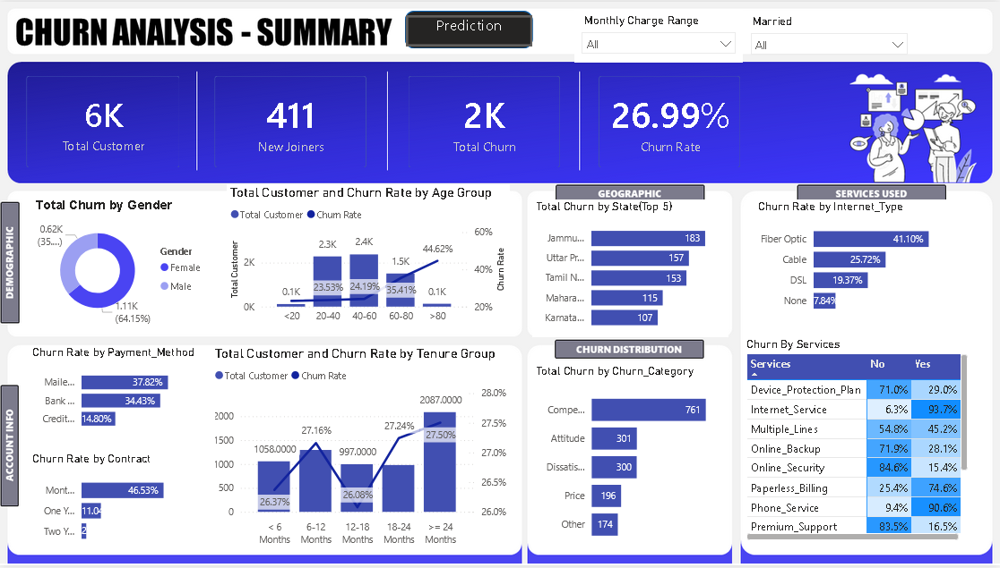
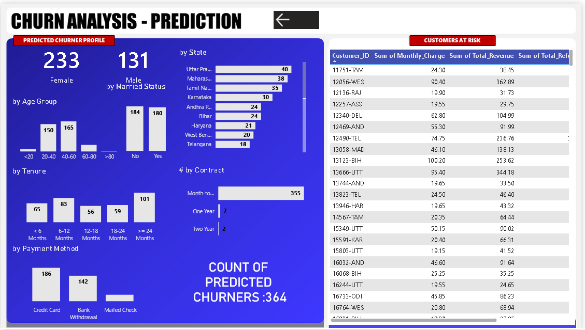

# 📉 Customer Churn Analysis & Prediction (Power BI + Machine Learning)
📌 Project Overview

Customer churn is a major challenge for subscription-based businesses.
This project combines exploratory churn analysis with machine learning–based churn prediction, delivered through interactive Power BI dashboards.

The objective is to:

Analyze historical churn behavior

Identify key churn drivers

Predict customers at high risk of churn

Support proactive retention strategies using data

# 🛠️ Tools & Technologies

Power BI – Data modeling & dashboarding

DAX – KPIs and calculated measures

Machine Learning – Churn prediction model

SQL / CSV – Data source

Power Query – Data cleaning & transformation
# 📊 Dashboards
🔹 1. Churn Analysis – Summary Dashboard

This dashboard provides a high-level analytical view of customer churn across multiple business dimensions.

Key KPIs

Total Customers: 6K

New Joiners: 411

Total Churn: 2K

Churn Rate: 26.99%

Analysis Covered

Churn by gender, age group, and tenure

Top churn-contributing states

Churn rate by payment method and contract type

Impact of internet services and add-on services

Customer distribution vs churn rate comparison

# 🔹 2. Churn Prediction – Machine Learning Dashboard

This dashboard is built using the output of a machine learning churn prediction model.
It focuses on identifying customers who are most likely to churn in the future, enabling targeted retention actions.

Machine Learning Highlights

Model predicts churn based on:

Demographics

Tenure

Contract type

Payment method

Service usage

Billing behavior

Model output is integrated into Power BI for business-friendly insights

Key Features

Predicted churners by:

Gender

Age group

Tenure

Contract type

Payment method

Customers at Risk table, showing:

Customer ID

Monthly charges

Total revenue

Referral count

State-wise churn risk distribution

Total Predicted Churners: 364

# 🎯 Business Impact

This project demonstrates how analytics + machine learning can:

Predict churn before it happens

Help businesses prioritize high-risk, high-value customers

Improve retention through data-driven decision making

Bridge the gap between technical ML output and business insights
